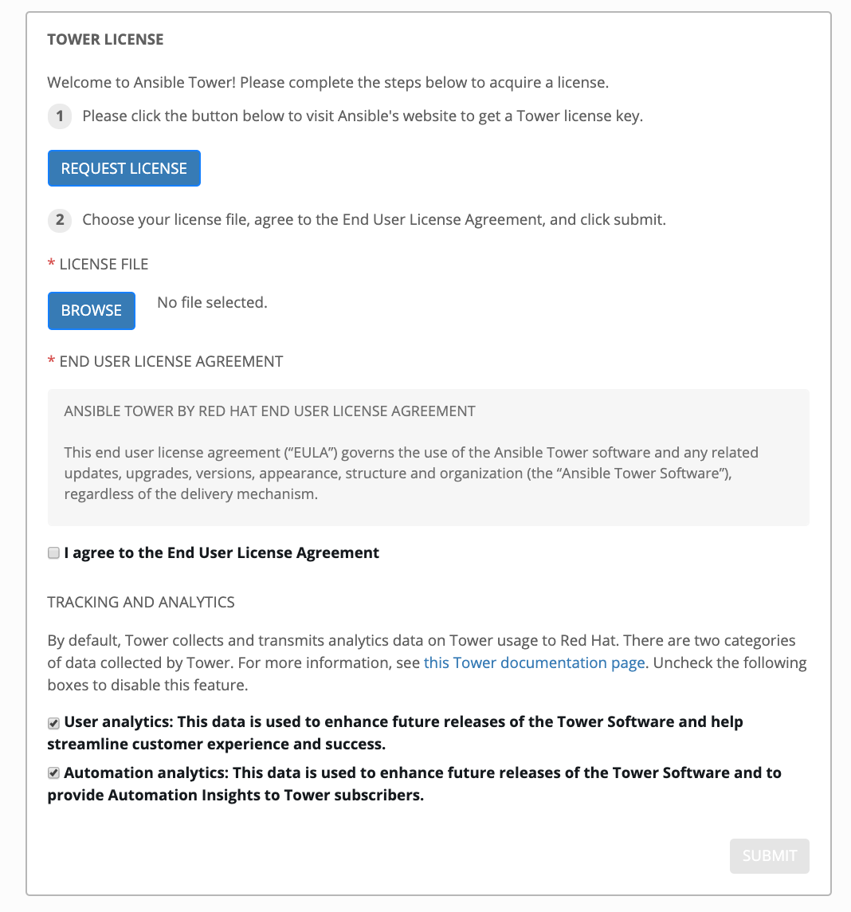

# Exercise 4-0: Red Hat Ansible Tower Setup

## Table of Contents

- [Objective](#Objective)
- [Guide](#Guide)

# Objective

Populate Red Hat Ansible Tower with all required resources.

To run an Ansible Playbook in Tower we need to create a **Job Template**.  A **Job Template** requires:
 - An **Inventory** to run the job against
 - A **Credential** is used to login to devices.
 - A **Project** which contains Playbooks

# Guide


There are multiple ways we can quickly setup Red Hat Ansible Tower.  For this workshop, we are giving you an Ansible playbooks to help automate the setup.

## Step 1: Request Tower Workshop License

If you have not done so already, navigate to the following url in order to request a 7-day license for your Ansible Tower instance: https://www.ansible.com/workshop-license. You will be prompted for the following information:

 - First and Last name
 - Company Name
 - Your Job Role
 - E-mail Address
 - Phone Number

Once you provide this information, you will receive your license file at the email address provided within five minutes. Download the file to your local file system as you will need to point to it when you first log into Ansible Tower. **Do not proceed until this step is completed.**


## Step 2: Tower Login

Make sure Tower is successfully installed by logging into it.  Open up your web browser and type in the Ansible control node's IP address e.g. https://X.X.X.X.  This is the same IP address has provided by the instructor.

Login information:
- The username will be `admin`
- password provided by instructor (typically 'ansible')

After logging in, you will be presented with a prompt for your Ansible Tower license:



Point to the license file you requested and downloaded, click the checkbox agreeing to the EULA and click submit.

Afterward, the Job Dashboard will be the default window as shown below.


## Step 3: Using the provided Ansible playbook to populate Ansible Tower

From the terminal window in your ansible control server, open the file `~/tower_setup/tower_setup.yml`. on line 48 (under the task named 'ADD CREDENTIAL INTO TOWER'), change the following line from:

`ssh_key_data: "/home/{{ansible_user}}/.ssh/aws-private.pem"`

to

`ssh_key_data: "/home/studentX/.ssh/aws-private.pem"`

Where `X` is the number you have been assigned by the instructor.

This change is needed as the playbook needs to be given the correct path to **your** SSH private key. As each student has a different number, this path will be unique for everyone.

Once this is completed, you can run the playbook using the `ansible-playbook` command:

```
[studentX@ansible ~]$ ansible-playbook tower_setup.yml
```

# Playbook Output

The output will look as follows.

```yaml

[studentX@ansible tower_setup]$ ansible-playbook tower_setup.yml

PLAY [TOWER CONFIGURATION WITH PLAYBOOKS] ***********************************************************

TASK [CREATE INVENTORY] *****************************************************************************
changed: [ansible]

TASK [ADD CONTROL HOST INTO TOWER] ******************************************************************
changed: [ansible]

TASK [ADD REPO INTO TOWER - PROJECT] ****************************************************************
changed: [ansible]

TASK [ADD CREDENTIAL INTO TOWER] ********************************************************************
changed: [ansible]

PLAY [ADD EACH HOST TO INVENTORY] *******************************************************************

TASK [ADD HOST INTO TOWER] **************************************************************************
changed: [rtr1]
changed: [rtr2]
changed: [rtr3]
changed: [rtr4]

PLAY RECAP ******************************************************************************************
ansible       : ok=4    changed=4    unreachable=0    failed=0    skipped=0    rescued=0    ignored=0   
rtr1          : ok=1    changed=1    unreachable=0    failed=0    skipped=0    rescued=0    ignored=0   
rtr2          : ok=1    changed=1    unreachable=0    failed=0    skipped=0    rescued=0    ignored=0   
rtr3          : ok=1    changed=1    unreachable=0    failed=0    skipped=0    rescued=0    ignored=0   
rtr4          : ok=1    changed=1    unreachable=0    failed=0    skipped=0    rescued=0    ignored=0
```

Running this playbook will populate your Ansible Tower environment with the following resources:

***Inventory:***

An inventory is required for Tower to be able to run jobs.  An Inventory is a collection of hosts against which jobs may be launched, the same as an Ansible inventory file. In addition, Tower can make use of an existing configuration management data base (cmdb) such as ServiceNow or Infoblox DDI.

>More info on Inventories in respect to Tower can be found in the [documentation here](https://docs.ansible.com/ansible-tower/latest/html/userguide/inventories.html)

By default Tower has a **Demo Inventory** setup. After running the `tower_setup.yml` playbook, under the Inventories there will be two inventories, the `Demo Inventory` and the `Workshop Inventory`.  Under the `Workshop Inventory` click the **Hosts** button to see the hosts that have been added to the inventory.

***Hosts:***

Hosts are the actual targets upon which playbooks perform automation. In the `Workshop Inventory` created by the `tower_setup.yml` playbook, you should see your four routers, along with the Ansible Tower/Control Server (with an inventory hostname of `ansible`).


***Project:***

A project is how actually Playbooks are imported into Red Hat Ansible Tower.  You can manage playbooks and playbook directories by either placing them manually under the Project Base Path on your Tower server, or by placing your playbooks into a source code management (SCM) system supported by Tower, including Git, Subversion, Mercurial, and Red Hat Insights.  

> For more information on Projects in Tower, please [refer to the documentation](https://docs.ansible.com/ansible-tower/latest/html/userguide/projects.html)

For these exercises, we are going to use an already existing Github repository and turn it into a project in Tower. Under the Inventories there will be two projects, the default `Demo Project` and the `Workshop Project` created by the `tower_setup.yml` playbook. Click into it in order to see the Github repository that Tower is pulling playbooks from.


***Credential:***

Credentials are utilized by Tower for authentication when launching Jobs against machines, synchronizing with inventory sources, and importing project content from a version control system.  For the workshop we need a credential to authenticate to the network devices.

> For more information on Credentials in Tower please [refer to the documentation](https://docs.ansible.com/ansible-tower/latest/html/userguide/credentials.html).

In the Tower UI, click on the Credentials link on the lefthand menu.  In addition to the default `Demo Credential` a new `Workshop Credential` will appear.


# Solution
You have finished this exercise.  

[Click here to return to the lab guide](../README.md)
